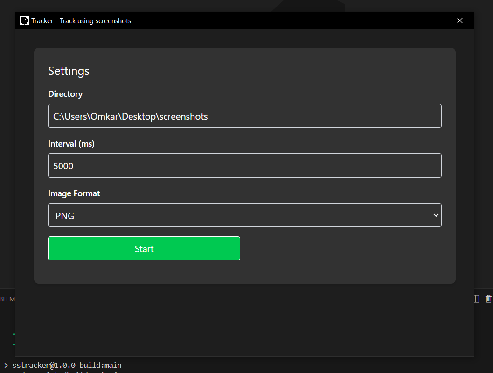

## Tracker

Description:
Takes screenshots periodically - Configure path, interval, format, start and stop, run in background, and get notifications!

---

Images:


---

Setup:

```bash
git clone https://github.com/omkarbhale/tracker
cd tracker
npm install
npm start # To start in development mode
```

---

Installation (Windows only, tested on win10):

-   (On google drive because of github's 100mb filesize limitation)
-   Download from https://drive.google.com/file/d/1wZM7fKOwjGHnoiUmUs1goThZQjXTxhdx/view?usp=sharing
-   Extract
-   Install from `SSTracker Setup 1.1.0.exe` OR
-   Start `win-unpacked/SSTracker.exe`

---

Features:

1. Minimizing and maximizing from System Tray
1. User settings
   -- Screenshot Path
   -- Time interval
   -- Image Format
1. Start and Stop capturing
1. Timer until next screenshot - at all times
1. Notifications
   -- Starting screenshots
   -- Stopping screenshots
   -- At the time of screenshot
   -- When minimizing to system tray

---

Executables (Tested only on windows):

1. Windows:
   Release can be found here: https://drive.google.com/file/d/1wZM7fKOwjGHnoiUmUs1goThZQjXTxhdx/view?usp=sharing
